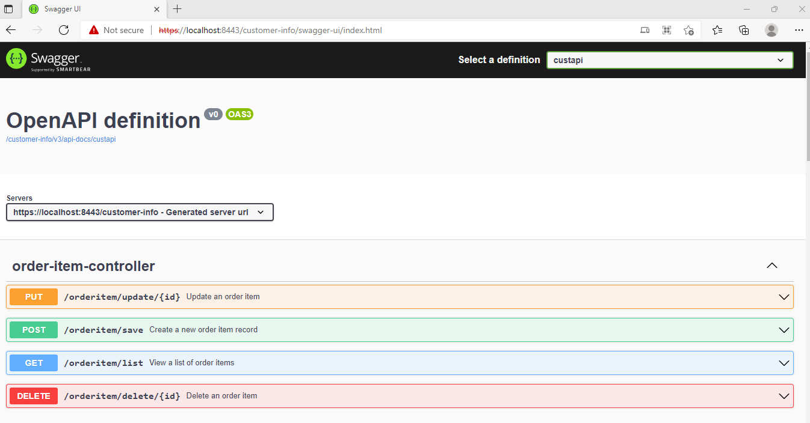

## spring-boot-read-http-request-header-write-http-response-header

Purpose : Enable https port 8443 for the spring boot application.  
Reason : Provide secure data transfer between rest api and client.   

### Local run steps  
1- Generate self signed ssl certificate by using JDK keytool.  
<pre>
D:\DEV\ssl>keytool -genkeypair -keypass password -storepass password -keystore serverkeystore -alias custapi -keyalg RSA -validity 365
What is your first and last name?
[Unknown]:
What is the name of your organizational unit?
[Unknown]:
What is the name of your organization?
[Unknown]:
What is the name of your City or Locality?
[Unknown]:
What is the name of your State or Province?
[Unknown]:
What is the two-letter country code for this unit?
[Unknown]:
Is CN=Unknown, OU=Unknown, O=Unknown, L=Unknown, ST=Unknown, C=Unknown correct?
[no]:  yes
</pre>
1.1- Export public key from keystore.  
<pre>
D:\DEV\ssl\1>keytool -export -alias custapi -keystore serverkeystore -storepass password -rfc -file custapi.crt
Certificate stored in file <custapi.crt>
</pre>
2- Move generated certificate file into your spring boot application resources directory named with "ssl".  

3- Add following properties into application.properties file.  
<pre>
server.ssl.key-store-type=PKCS12  
server.ssl.key-store=classpath:ssl/serverkeystore  
server.ssl.key-store-password=password  
server.ssl.key-alias=custapi  
server.ssl.enabled=true  
server.port=8443  
</pre>
4- Start Spring Boot API by running main method containing class CustomerInfoApplication.java in your IDE.  
5- Alternatively you can start your Docker container by following the commands below.  
NOT : Execute maven command from where the pom.xml is located in the project directory to create Spring Boot executable jar.  
<pre> 
$ mvn clean install -U -X  
</pre>

In order to check the https ssl configuration swagger_ui can be accessed via https secure port :  
https://localhost:8443/customer-info/swagger-ui/index.html   
  

### Tech Stack
Java 11  
H2 Database Engine  
spring boot  
spring boot starter data jpa  
spring boot starter web  
spring boot starter test  
springfox swagger ui  
springdoc openapi ui  
spring security web  
hibernate  
logback  
maven  
hikari connection pool  
Docker  
 

### Docker build run steps
NOT : Execute docker commands from where the DockerFile is located.  
NOT : Tested on Windows 10 with Docker Desktop Engine Version : 20.10.11  
<pre>
$ docker system prune -a --volumes  
$ docker build . --tag demo   
$ docker images  
  REPOSITORY   TAG       IMAGE ID       CREATED         SIZE  
  demo         latest    9d4a0ec3294e   6 minutes ago   288MB  
$ docker run -p 8443:8443 -e "SPRING_PROFILES_ACTIVE=dev" demo:latest  
</pre>

## API OPERATIONS
### Save a new customer to database

Method : HTTP.POST  
URL : https://localhost:8443/customer-info/customer/save  
Request Body :  
{  
&ensp;    "name": "name1",  
&ensp;    "age": 1,  
&ensp;    "shippingAddress": {  
&emsp;        "address": {  
&emsp;            "streetName": "software",  
&emsp;            "city": "ankara",  
&emsp;            "country": "TR"  
&emsp;        }  
&ensp;    }  
}  

Curl Request :  
<pre>
curl --location --request POST 'https://localhost:8443/customer-info/customer/save' \
--header 'Content-Type: application/json' \
--header 'Cookie: JSESSIONID=5E6B21C9533643F4A7EE462DCBB3B312' \
--data-raw '{
    "name": "name1",
    "age": 1,
    "shippingAddress": {
        "address": {
            "streetName": "software",
            "city": "ankara",
            "country": "TR"
        }
    }
}'
</pre> 

Response : 

HTTP response code 200  
<pre>
{
    "id": 1,
    "name": "name1",
    "age": 1,
    "shippingAddress": {
        "id": 1,
        "address": {
            "id": 1,
            "streetName": "software",
            "city": "ankara",
            "country": "TR"
        }
    }
}
</pre>

### List all customers saved to database

Method : HTTP.GET  
URL : https://localhost:8443/customer-info/customer/list  
Request Body :  
{} 
Curl Request :  
<pre>
curl --location --request GET 'https://localhost:8443/customer-info/customer/list' \
--header 'Content-Type: application/json' \
--header 'Cookie: JSESSIONID=5E6B21C9533643F4A7EE462DCBB3B312' \
--data-raw '{}'
</pre>
 

Response : 

HTTP response code 200  
<pre>
[
    {
        "id": 1,
        "name": "name1",
        "age": 1,
        "shippingAddress": {
            "id": 1,
            "address": {
                "id": 1,
                "streetName": "software",
                "city": "ankara",
                "country": "TR"
            }
        }
    }
]
</pre>
 
